# 化学物質管理システム 画面設計書

| 版 | 1.1（2026-07-03） |
|---|---|
| 目的 | 各画面のレイアウト・項目・操作・遷移・メッセージ・権限表示制御を定義し、画面の再現実装を可能にする |
| 関連 | 機能ロジックは『詳細機能仕様書』、DBは『data-model.md』、判定は『judgment-engine.md』 |
| 記法 | 各画面に実装UIのスクリーンショット（テストデータ表示）＋ASCIIワイヤーフレームを併記。`[ボタン]` `▼セレクト` `☑チェック` `____入力欄` `《表》`。項目の必須は「○」 |
| 画像 | スクリーンショットは `mockups/` 配下のHTML（実装と同一のUIライブラリ配色を再現）をヘッドレスブラウザで撮影したもの。ソースは `docs/mockups/*.html`、出力は `docs/mockups/img/*.png` |

---

# 1. 共通事項

## 1.1 画面構成（認証後の全画面共通）
```
┌───────────────────────────────────────────────────────────────┐
│ ヘッダー（固定）                                               │
├───────────────────────────────────────────────────────────────┤
│                                                               │
│   コンテンツ領域（中央寄せ・最大幅 max-w-4xl〜6xl）           │
│                                                               │
└───────────────────────────────────────────────────────────────┘
```

## 1.2 ヘッダー
```
┌───────────────────────────────────────────────────────────────┐
│ 化学物質管理システム  物質 製品 法規制 リンク 金属換算 取込/出力 [管理] │
│                         山田(user@..) 《特権ユーザー》《参照のみ》 ▼日本語 [ログアウト] │
└───────────────────────────────────────────────────────────────┘
```
| 要素 | 内容・表示条件 |
|---|---|
| ロゴ「化学物質管理システム」 | クリックでホーム（/）へ |
| ナビ | 物質/製品/法規制/リンク/金属換算/取込・出力。「管理」は**システム管理者のみ**表示 |
| ユーザー名 | `displayName`（メール）。未設定は「(名前未設定)」 |
| ロールバッジ | システム管理者／特権ユーザー／非特権ユーザー |
| 「参照のみ」バッジ | **編集権限なし**のとき表示 |
| 言語切替▼ | **有効ロケールが2件以上**のとき表示。選択→即保存し再読込 |
| [ログアウト] | サインアウト→/login |
| （未ログイン時） | ヘッダー非表示 |

## 1.3 共通コンポーネントの挙動
- **一覧＋検索**: 検索欄＋[検索]（Enterでも実行）。部分一致・大小文字無視。ページング50件/頁、下部「全 N 件」「X / Y」[前へ][次へ]（端で無効化）。
- **削除**: 確認ダイアログ→OKで削除。参照ありは1回目が警告文（件数入り）→再確認ダイアログでOKすると強制削除。
- **保存ボタン**: 処理中は「保存中...」等に変化し無効化。
- **メッセージ表示**: フォーム下に色付き帯。赤=エラー、無地=情報/警告（警告は先頭に「⚠️」）。

## 1.4 権限による表示制御（全画面共通ルール）
| 対象ユーザー | 挙動 |
|---|---|
| 編集権限なし | 一覧の[＋新規登録][削除][複製]等を**非表示**。[編集]→「表示」表記。フォームは入力欄を**無効化(グレー)**、[保存]非表示、上部に注記「参照のみ: 編集権限がないため、登録・変更・削除はできません（判定実行とダウンロードは可能です）」 |
| 非特権ユーザー | 製品の非公開/組成公開チェックボックスを**非表示**。非公開製品は一覧・詳細に出ない。組成非開示製品では組成エディタの代わりに注記 |
| システム管理者以外 | ヘッダー「管理」非表示、/admin・/admin/locales はデータ取得時に「この画面はシステム管理者のみ利用できます」 |

---

# 2. 画面一覧

| 画面ID | 画面名 | URL |
|---|---|---|
| SC-LOGIN | ログイン | /login |
| SC-HOME | ホーム | / |
| SC-SUB-LIST | 物質一覧 | /substances |
| SC-SUB-EDIT | 物質 登録/編集 | /substances/new・/substances/{id} |
| SC-MF | 金属換算係数 | /metal-factors |
| SC-PRD-LIST | 製品一覧 | /products |
| SC-PRD-EDIT | 製品 登録/編集（組成・展開・判定） | /products/new・/products/{id} |
| SC-LAW-LIST | 法規制一覧 | /laws |
| SC-LAW-EDIT | 法律 登録/編集 | /laws/new・/laws/{id} |
| SC-CAT-EDIT | 規制区分 登録/編集 | /laws/{id}/categories/new・/categories/{id} |
| SC-LV-LIST | リンクバージョン一覧 | /link-versions |
| SC-LV-EDIT | リンクバージョン詳細 | /link-versions/{id} |
| SC-SRC | 情報源 | /sources |
| SC-IO | TSV取込/出力 | /import-export |
| SC-DOC | ドキュメント生成 | /doc-templates |
| SC-ADMIN | 管理（ユーザー・設定） | /admin |
| SC-LOCALE | 多言語 | /admin/locales |

# 3. 画面遷移図
```
                    [/login] ──ログイン──▶ [/ ホーム]
                       ▲                        │
                    ログアウト        ┌──────────┼───────────┬────────────┬───────────┐
                       │              ▼          ▼           ▼            ▼           ▼
                    (全画面)      物質一覧    製品一覧    法規制一覧   リンク版一覧  金属換算/取込出力/生成
                                    │           │           │            │
                                    ▼           ▼           ▼            ▼
                                物質編集     製品編集     法律編集    リンク版詳細
                                (逆引き)   (組成/展開/判定) │(区分表)    (リンク登録)
                                                            ▼            │
                                                        区分編集         ▼
                                                     (法文物質名)     情報源
     [管理]──▶ /admin ──▶ /admin/locales
```
- 未認証で保護画面に来ると /login（307）。認証済みで /login はホームへ。

---

# 4. 画面設計

## SC-LOGIN ログイン（/login）

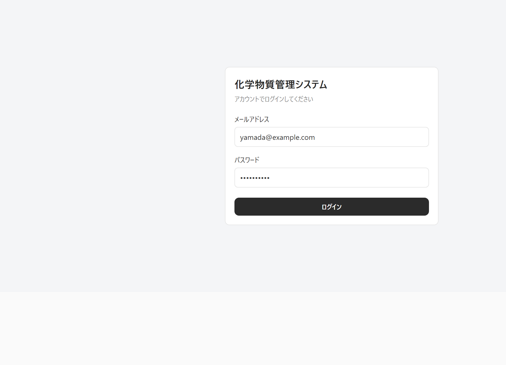

```
                 ┌─────────────────────────────┐
                 │ 化学物質管理システム        │
                 │ アカウントでログインしてください │
                 │                             │
                 │ メールアドレス              │
                 │ [__________________________]│
                 │ パスワード                  │
                 │ [__________________________]│
                 │ （エラー時: 赤帯）          │
                 │ [        ログイン        ] │
                 └─────────────────────────────┘
```
| No | 項目 | コントロール | 必須 | 入力チェック |
|---|---|---|---|---|
| 1 | メールアドレス | text(email) | ○ | メール形式 |
| 2 | パスワード | password | ○ | |
- アクション: [ログイン]→認証成功でホームへ。失敗で赤帯「メールアドレスまたはパスワードが正しくありません」。処理中「ログイン中...」。

## SC-HOME ホーム（/）

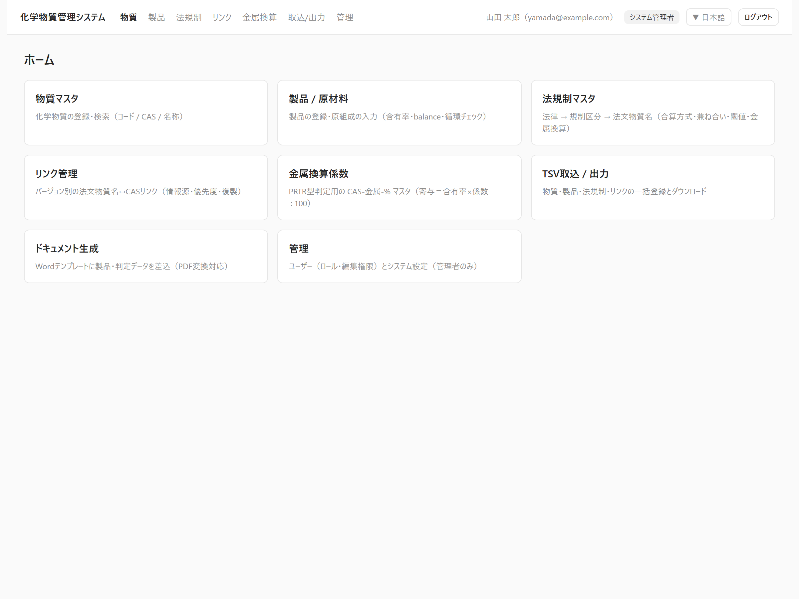

```
ホーム
┌───────────┐ ┌───────────┐ ┌───────────┐
│ 物質マスタ │ │ 製品/原材料│ │ 法規制マスタ│
│ 説明文...  │ │ 説明文...  │ │ 説明文...  │
└───────────┘ └───────────┘ └───────────┘
┌───────────┐ ┌───────────┐ ┌───────────┐
│ リンク管理 │ │ 金属換算係数│ │TSV取込/出力│
└───────────┘ └───────────┘ └───────────┘
┌───────────┐ ┌───────────┐
│ドキュメント生成│ │ 管理      │
└───────────┘ └───────────┘
```
- カード8枚。クリックで各画面へ。題・説明は多言語対応（言語切替で英語表示）。

## SC-SUB-LIST 物質一覧（/substances）

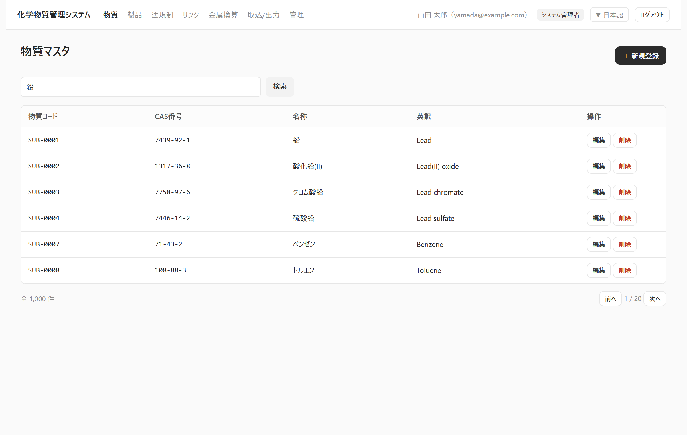

```
物質マスタ                                          [＋ 新規登録]
[コード / CAS番号 / 名称で検索____________] [検索]
《表》
 物質コード │ CAS番号   │ 名称           │ 英訳   │ 操作
 SUB-0001  │ 7439-92-1 │ 鉛（他2件）    │ Lead  │ [編集][削除]
 ...
全 N 件                                   [前へ] 1/Y [次へ]
```
| 列 | 内容 |
|---|---|
| 物質コード / CAS番号 | 等幅表示 |
| 名称 | メイン日本語名称。サブがあれば「（他N件）」 |
| 英訳 | メイン英訳 |
| 操作 | [編集]（編集不可は「表示」）・[削除]（編集可のみ） |
- [＋新規登録]（編集可のみ）→SC-SUB-EDIT(new)。[編集]→SC-SUB-EDIT(id)。
- 削除確認「物質「コード: 名称」を削除しますか？」／参照あり「この物質は N 件の組成から参照されています。…」→再確認で強制。

## SC-SUB-EDIT 物質 登録/編集（/substances/new・/{id}）

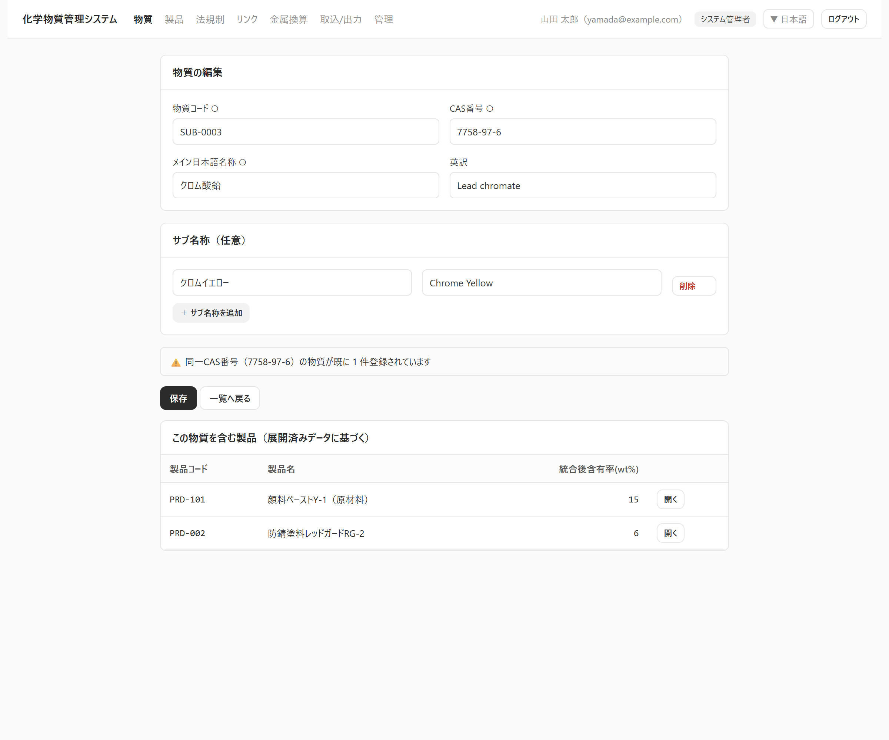

```
（参照のみ注記：編集不可時）
┌ 物質の登録／編集 ──────────────────────────────┐
│ 物質コード ○[__________]  CAS番号 ○[__________] │
│ メイン日本語名称 ○[__________] 英訳[__________]  │
└───────────────────────────────────────────────┘
┌ サブ名称（任意）──────────────────────────────┐
│ [日本語名称____][英訳____][削除]                │
│ [＋ サブ名称を追加]                             │
└───────────────────────────────────────────────┘
（警告/保存メッセージ帯）
[保存] [一覧へ戻る]
── 編集時のみ ──
┌ この物質を含む製品（展開済みデータに基づく）────┐
│ 製品コード│製品名│統合後含有率(wt%)│[開く]      │
└───────────────────────────────────────────────┘
```
| No | 項目 | コントロール | 必須 | 桁 | 入力チェック |
|---|---|---|---|---|---|
| 1 | 物質コード | text | ○ | ≤100 | 一意（重複409） |
| 2 | CAS番号 | text | ○ | ≤50 | 非一意許容 |
| 3 | メイン日本語名称 | text | ○ | ≤500 | |
| 4 | メイン英訳 | text | − | ≤500 | |
| 5 | サブ名称（複数） | text×2/行 | − | ≤500 | 日本語空行は無視 |
- [保存]: 成功で一覧へ。同一CAS存在時はその場に「⚠️ 同一CAS番号（X）の物質が既に N 件登録されています」＋「保存しました。」。コード重複は赤帯「物質コード「X」は既に使用されています」。
- 逆引き表: 統合後含有率（非開示製品は「（非開示）」）、[開く]→SC-PRD-EDIT。展開未実行の製品は出ない。

## SC-MF 金属換算係数（/metal-factors）

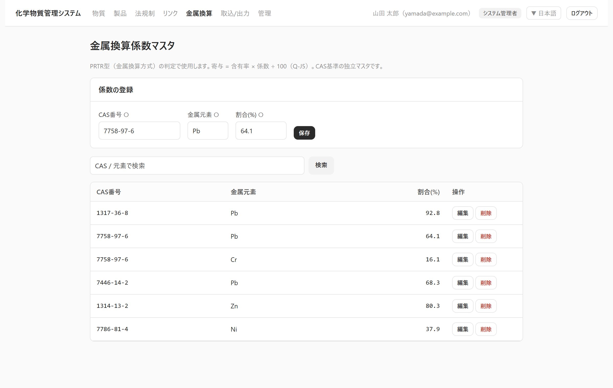

```
金属換算係数マスタ
説明: PRTR型…寄与 = 含有率 × 係数 ÷ 100
┌ 係数の登録／編集 （編集可のみ）───────────────┐
│ CAS番号 ○[________] 金属元素 ○[__] 割合(%) ○[____] [保存] [キャンセル] │
└───────────────────────────────────────────────┘
[CAS / 元素で検索______] [検索]
《表》 CAS番号 │ 金属元素 │ 割合(%) │ 操作[編集][削除]
```
| No | 項目 | 必須 | 入力チェック |
|---|---|---|---|
| 1 | CAS番号 | ○ | ≤50 |
| 2 | 金属元素 | ○ | `^[A-Z][a-z]{0,2}$`（例 Pb） |
| 3 | 割合(%) | ○ | 0<x≤100・小数6桁 |
- [保存]: 成功「保存しました」。マスタ未登録CAS「⚠️ CAS番号「X」は物質マスタに未登録です」。重複「CAS「X」×元素「Y」の係数は既に登録されています」。
- [編集]→フォームに値セット・画面上部へスクロール。[キャンセル]で新規モードに戻る。

## SC-PRD-LIST 製品一覧（/products）

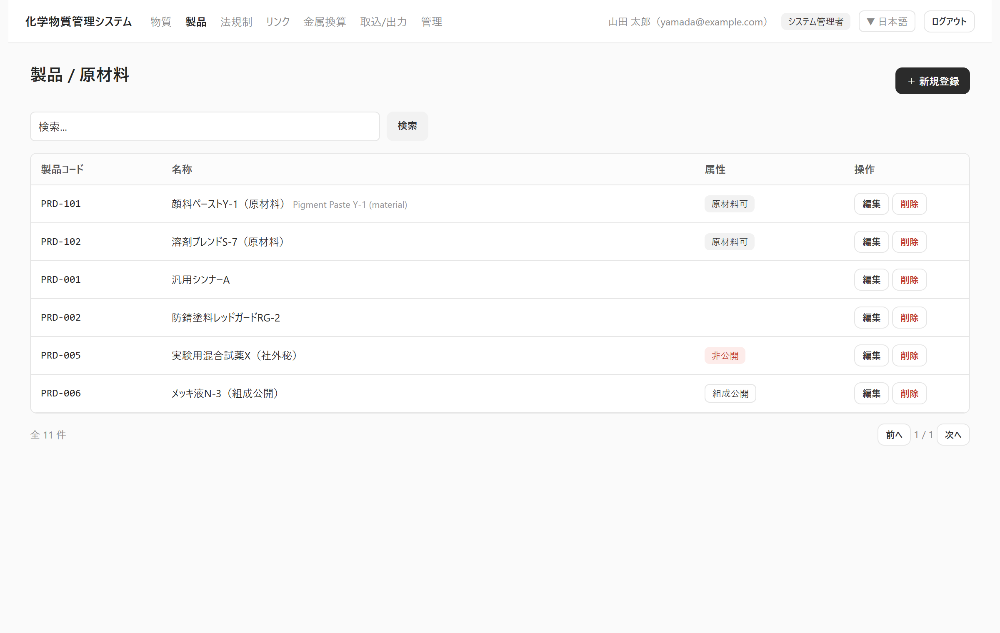

```
製品 / 原材料                                       [＋ 新規登録]
[コード / 名称で検索______] [検索]
《表》 製品コード │ 名称 │ 属性《原材料可》《非公開》《組成公開》│ 操作[編集][削除]
全 N 件  [前へ] 1/Y [次へ]
```
- 非特権には**非公開製品を表示しない**。属性はバッジ。操作は権限で出し分け。

## SC-PRD-EDIT 製品 登録/編集（/products/new・/{id}）
編集画面は「製品フォーム→組成エディタ→展開→判定」を縦に積む（製品PRD-002での画面例を以下に示す）。

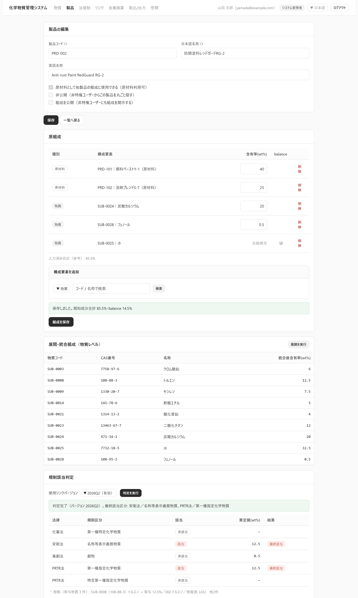

```
┌ 製品の登録／編集 ─────────────────────────────┐
│ 製品コード ○[______]  日本語名称 ○[__________] │
│ 英語名称[__________]                           │
│ ☑ 原材料として他製品の組成に使用できる（原材料利用可）│
│ ☑ 非公開（…）        ← 特権のみ表示            │
│ ☑ 組成を公開（…）    ← 特権のみ表示            │
└───────────────────────────────────────────────┘
[保存] [一覧へ戻る]
```
| No | 項目 | コントロール | 必須 | 権限 |
|---|---|---|---|---|
| 1 | 製品コード | text | ○(≤100一意) | 編集可 |
| 2 | 日本語名称 | text | ○(≤500) | 編集可 |
| 3 | 英語名称 | text | −(≤500) | 編集可 |
| 4 | 原材料利用可 | checkbox | − | 編集可 |
| 5 | 非公開フラグ | checkbox | − | **特権のみ** |
| 6 | 組成公開フラグ | checkbox | − | **特権のみ** |
- 新規[保存]→編集画面へ遷移。原材料利用可オフ化で参照ありは警告（保存可）。

### 組成エディタ（カード「原組成」）
```
┌ 原組成 ───────────────────────────────────────┐
│《表》種別《物質》│構成要素(コード｜名称)│含有率(wt%)[__]│balance☑│[削除]│
│ 入力済み合計（参考）: X%                       │
│┌ 構成要素を追加 （編集可のみ）───────────────┐│
││ ▼物質/原材料  [コード / 名称で検索__][検索]  ││
││ （候補リスト最大10件・クリックで追加）        ││
│└─────────────────────────────────────────────┘│
│ （エラー/警告/結果メッセージ）                  │
│ [組成を保存]                                    │
└───────────────────────────────────────────────┘
```
| 列 | コントロール | 入力チェック |
|---|---|---|
| 種別 | バッジ（物質/原材料） | |
| 構成要素 | 検索選択（追加時） | 物質 or 原材料利用可の製品。自己・重複・非公開(非特権)不可 |
| 含有率(wt%) | text | 0<x≤100・小数6桁。balance時は無効「自動補完」 |
| balance | checkbox | 1製品1件 |
- [組成を保存]: 成功「保存しました。既知成分合計 X%（・balance Y%）」。エラー（複数同時・保存されない）例:「循環参照が発生するため登録できません…」「同一の物質が複数行に指定されています」「「コード」は原材料利用可フラグがオフのため…」、合計系（設定モード依存）。
- 組成非開示×非特権のときは、エディタの代わりに注記「この製品の組成は非開示です（…特権ユーザーのみ閲覧・編集できます）」。

### 展開・判定（カード）
```
┌ 展開・統合組成（物質レベル）           [展開を実行] ┐
│《表》物質コード│CAS番号│名称│統合後含有率(wt%)      │
└───────────────────────────────────────────────────┘
┌ 規制該当判定 ─────────────────────────────────────┐
│ 使用リンクバージョン ▼[2026Q2（有効）]  [判定を実行]│
│ （緑帯）判定完了（バージョン X）。最終該当区分: …  │
│《表》法律│規制区分│該当《該当/非該当》│算定値│結果《最終該当/抑制》│
│    └ 根拠（寄与物質 N 件）▼ …                      │
│ 判定履歴（最新20件）: 実行日時│版│最終該当区分│[表示]│
└───────────────────────────────────────────────────┘
```
- [展開を実行]: 組成閲覧可の人のみ。非開示×非特権は「この製品の組成は非開示です」。
- 使用バージョン▼: 初期選択＝有効(ACTIVE)版。[判定を実行]（編集権限不要・版未選択時無効）。
- 結果表: 該当＝赤バッジ、最終該当/抑制バッジ。根拠を開くと寄与物質・情報源。非開示×非特権は明細マスク＋注記。

## SC-LAW-LIST 法規制一覧（/laws）

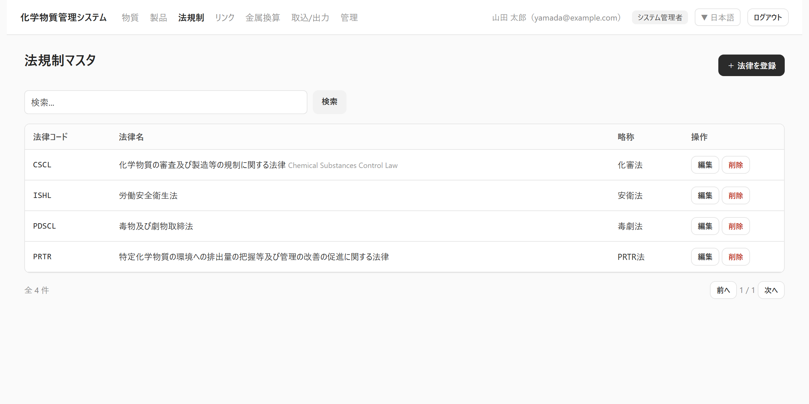

```
法規制マスタ                                       [＋ 法律を登録]
[コード / 法律名 / 略称で検索______] [検索]
《表》 法律コード │ 法律名（英併記）│ 略称 │ 操作[編集][削除]
```

## SC-LAW-EDIT 法律 登録/編集（/laws/new・/{id}）

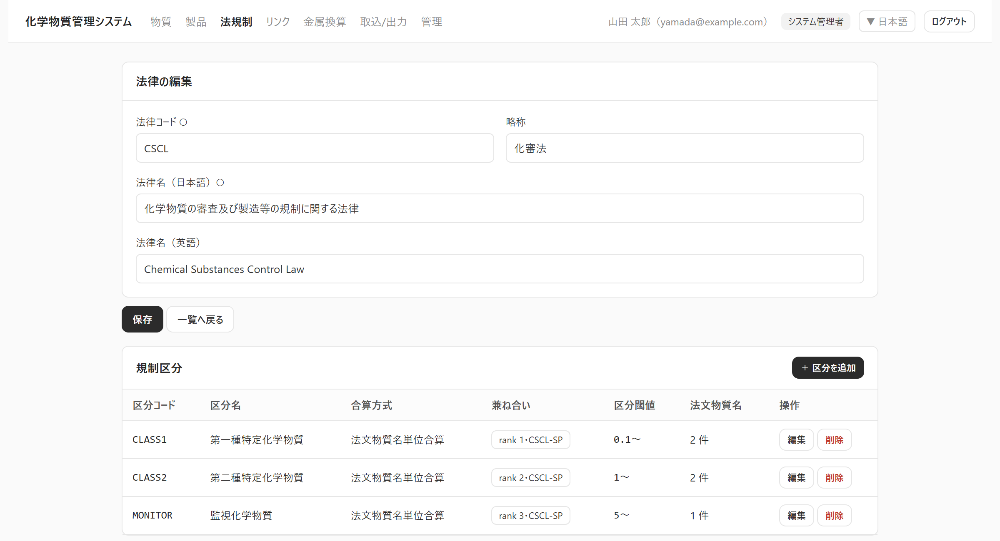

```
┌ 法律の登録／編集 ─────────────────────────────┐
│ 法律コード ○[______]   略称[______]            │
│ 法律名（日本語）○[__________________]          │
│ 法律名（英語）[__________________]              │
│ 備考[__________________]                       │
└───────────────────────────────────────────────┘
[保存] [一覧へ戻る]
── 編集時 ──
┌ 規制区分                             [＋ 区分を追加]┐
│《表》区分コード│区分名│合算方式│兼ね合い│区分閾値│法文物質名│操作│
└───────────────────────────────────────────────────┘
```
| No | 項目 | 必須 | 桁 |
|---|---|---|---|
| 1 | 法律コード | ○ | ≤100（一意） |
| 2 | 略称 | − | ≤100 |
| 3 | 法律名（日本語） | ○ | ≤500 |
| 4 | 法律名（英語） | − | ≤500 |
| 5 | 備考 | − | ≤2000 |
- 区分表: 兼ね合い＝「rank N・グループ名」または「独立」、区分閾値＝「下限〜上限」または「—」。[＋区分を追加]→SC-CAT-EDIT(new)、[編集/表示]→SC-CAT-EDIT(id)。

## SC-CAT-EDIT 規制区分 登録/編集（/laws/{id}/categories/new・/categories/{id}）

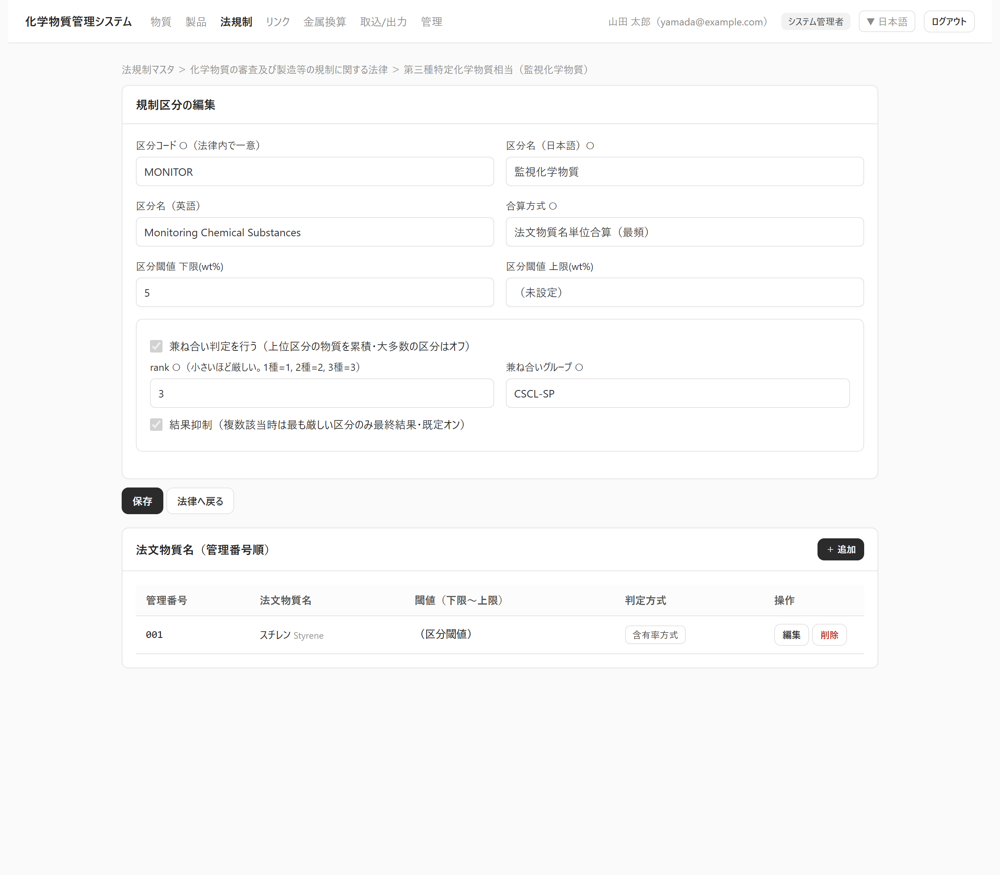

```
法規制マスタ ＞ 法律名 ＞ 区分名
┌ 規制区分の登録／編集 ─────────────────────────┐
│ 区分コード ○[______]  区分名(日)○[______] (英)[______]│
│ 合算方式 ○▼[法文物質名単位合算(最頻)/区分全体合算/合算なし]│
│ 区分閾値 下限[__] 上限[__]                     │
│ ☑ 兼ね合い判定を行う                            │
│    └ rank ○[__]  兼ね合いグループ ○[______]   │
│ ☑ 結果抑制（複数該当時は最も厳しい区分のみ）    │
└───────────────────────────────────────────────┘
[保存] [法律へ戻る]
┌ 法文物質名（管理番号順）                    [＋ 追加]┐
│ （追加/編集インラインフォーム）                     │
│《表》管理番号│法文物質名(英併記)│閾値│判定方式《…》│操作│
└───────────────────────────────────────────────────┘
```
| No | 項目 | 必須 | 入力チェック |
|---|---|---|---|
| 1 | 区分コード | ○ | 法律内一意 |
| 2 | 区分名(日/英) | ○/− | ≤500 |
| 3 | 合算方式 | ○ | 3択 |
| 4 | 区分閾値 下限/上限 | − | 0≤x≤100・下限≤上限 |
| 5 | 兼ね合い判定 | − | オンで rank/グループ欄が出現 |
| 6 | rank | 兼ね合い時○ | 整数≥1 |
| 7 | 兼ね合いグループ | 兼ね合い時○ | ≤100 |
| 8 | 結果抑制 | − | 既定オン |
- バリデーション赤帯: 「兼ね合いフラグがオンの区分には rank（順位）／兼ね合いグループが必須です」「閾値の下限が上限を超えています」。

### 法文物質名 インラインフォーム
```
┌ 法文物質名の追加／編集 ───────────────────────┐
│ 管理番号 ○[__] 法文物質名(日)○[______] (英)[______]│
│ 閾値 下限[__] 上限[__] 判定方式 ○▼[含有率/金属換算] 判定金属元素[__]│
│ [保存] [キャンセル]                             │
└───────────────────────────────────────────────┘
```
| No | 項目 | 必須 | 入力チェック |
|---|---|---|---|
| 1 | 管理番号 | ○ | 区分内一意 |
| 2 | 法文物質名(日/英) | ○/− | |
| 3 | 閾値 下限/上限 | − | 無ければ区分閾値を使用 |
| 4 | 判定方式 | ○ | 含有率/金属換算 |
| 5 | 判定金属元素 | 金属換算時○ | 含有率方式では入力不可(無効) |
- バリデーション: 「金属換算方式の法文物質名には判定金属元素が必須です」等。

## SC-LV-LIST リンクバージョン一覧（/link-versions）

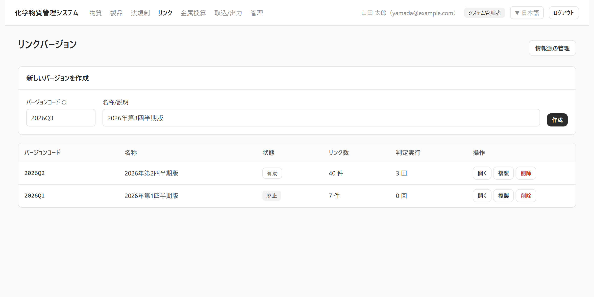

```
リンクバージョン                              [情報源の管理]
┌ 新しいバージョンを作成 （編集可のみ）─────────┐
│ バージョンコード ○[______] 名称/説明[______] [作成]│
└───────────────────────────────────────────────┘
《表》 バージョンコード│名称│状態《ドラフト/有効/廃止》│リンク数│判定実行│操作[開く][複製][削除]
```
- [情報源の管理]→SC-SRC。[開く]→SC-LV-EDIT。[複製]（編集可）: 入力ダイアログ→「複製しました（リンク N 件をコピー）」。[削除]（編集可）: リンク/判定実行があると不可。

## SC-LV-EDIT リンクバージョン詳細（/link-versions/{id}）

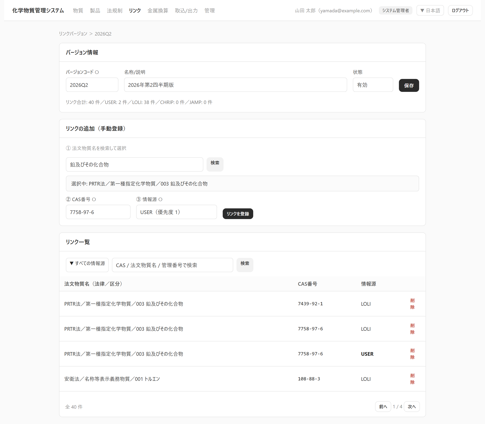

```
リンクバージョン ＞ コード
┌ バージョン情報 ───────────────────────────────┐
│ コード[______] 名称[______] 状態▼[…] [保存]     │
│ リンク合計: N 件／USER: n／LOLI: n…             │
└───────────────────────────────────────────────┘
┌ リンクの追加（手動登録）（編集可のみ）─────────┐
│ ① 法文物質名を検索 [______][検索]→候補→選択中: …│
│ ② CAS番号 ○[______]  ③ 情報源 ▼[USER(優先度1)] [リンクを登録]│
└───────────────────────────────────────────────┘
┌ リンク一覧 ───────────────────────────────────┐
│ ▼[すべての情報源] [CAS/法文物質名/管理番号で検索][検索]│
│《表》法文物質名(法律／区分)│CAS番号│情報源│[削除]  │
└───────────────────────────────────────────────┘
```
- バージョン情報[保存]（編集可）。追加: ①法文物質名選択→②CAS→③情報源→[リンクを登録]。成功「リンクを登録しました」、未登録CAS警告、重複「同じリンクが既に登録されています」。
- リンク一覧[削除]（編集可）: 判定根拠参照中は不可。

## SC-SRC 情報源（/sources）

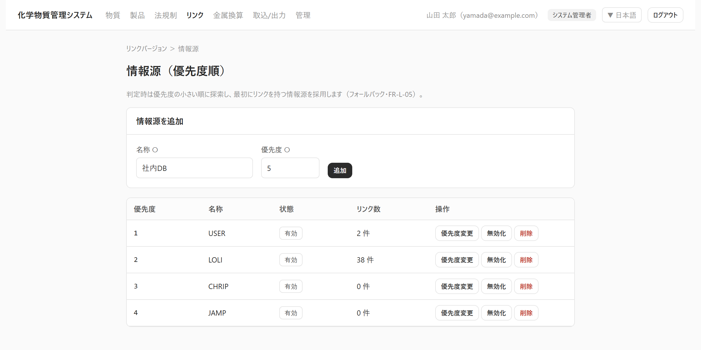

```
リンクバージョン ＞ 情報源
情報源（優先度順）
説明: 判定時は優先度の小さい順に…
┌ 情報源を追加 （編集可のみ）───────────────────┐
│ 名称 ○[______]  優先度 ○[__] [追加]            │
└───────────────────────────────────────────────┘
《表》 優先度│名称│状態《有効/無効》│リンク数│操作[優先度変更][無効化/有効化][削除]
```
- [優先度変更]: 入力ダイアログ。[削除]: リンク参照中は不可。

## SC-IO TSV取込/出力（/import-export）

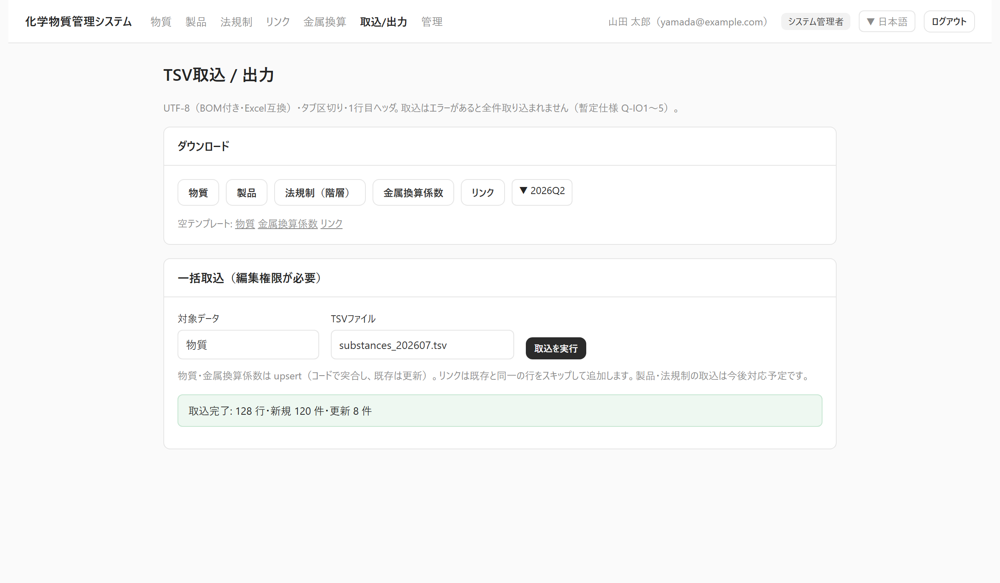

```
TSV取込 / 出力
注記: UTF-8（BOM付き）・タブ区切り・1行目ヘッダ…
┌ ダウンロード ─────────────────────────────────┐
│ [物質][製品][法規制（階層）][金属換算係数] [リンク]▼[2026Q2]│
│ 空テンプレート: 物質 金属換算係数 リンク       │
└───────────────────────────────────────────────┘
┌ 一括取込 （編集可のみ）───────────────────────┐
│ 対象 ▼[物質] （リンク時）取込先 ▼[版] ファイル[選択] [取込を実行]│
│ （結果/エラー一覧）                             │
└───────────────────────────────────────────────┘
```
- ダウンロードは誰でも可（非特権の製品出力は非公開除外）。取込は編集可のみ。成功「取込完了: N 行・新規 X 件・更新 Y 件（・既存スキップ Z 件）」。エラーは赤で「N行目: …」（最大50件・全件ロールバック）。

## SC-DOC ドキュメント生成（/doc-templates）

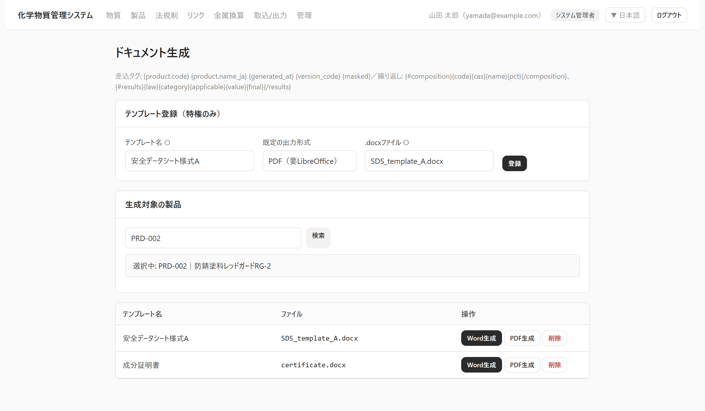

```
ドキュメント生成
タグ説明: {product.code} {#composition}… など
┌ テンプレート登録（特権のみ機能）──────────────┐
│ 名称 ○[______] 出力形式▼[Word/PDF] .docx[選択] [登録]│
└───────────────────────────────────────────────┘
┌ 生成対象の製品 ───────────────────────────────┐
│ [コード/名称で検索][検索]→候補→選択中: …       │
└───────────────────────────────────────────────┘
《表》 テンプレート名│ファイル│操作[Word生成][PDF生成][削除]
```
| No | 項目 | 必須 | 制約 |
|---|---|---|---|
| 1 | テンプレート名 | ○ | |
| 2 | 出力形式 | − | Word（そのまま）/ PDF（要LibreOffice） |
| 3 | .docxファイル | ○ | .docxのみ・≤10MB |
- 登録・削除は特権のみ。生成は誰でも可（製品未選択で押すと「先に対象製品を選択してください」）。PDF未対応環境は「PDF変換には LibreOffice のインストールが必要です（Word形式では生成できます）」。生成物はブラウザDL（`製品コード_テンプレ名.docx/.pdf`）。

## SC-ADMIN 管理（/admin・管理者のみ）

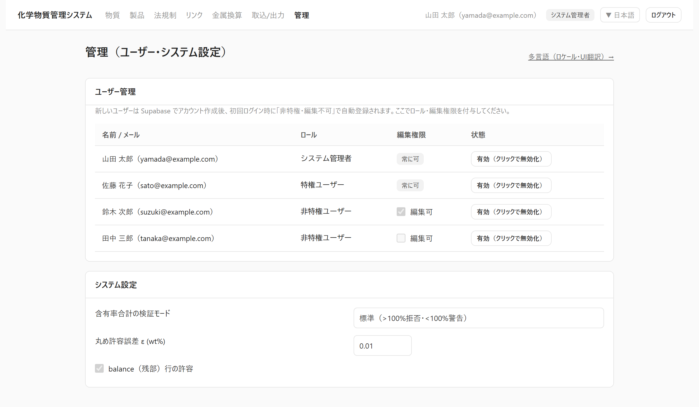

```
管理（ユーザー・システム設定）        多言語（ロケール・UI翻訳）→
┌ ユーザー管理 ─────────────────────────────────┐
│《表》名前/メール│ロール▼│編集権限☑(非特権のみ)│状態[有効/無効]│
└───────────────────────────────────────────────┘
┌ システム設定 ─────────────────────────────────┐
│ 含有率合計の検証モード ▼[厳格/標準/緩和]       │
│ 丸め許容誤差 ε [____]（フォーカスアウトで保存） │
│ balance行の許容 ☑                              │
└───────────────────────────────────────────────┘
```
- ロール▼（即保存）、編集権限☑（非特権のみ・管理者/特権は「常に可」バッジ）、状態トグル。自己のロール変更/無効化は不可（アラート）。
- システム設定: モード▼即保存、ε＝フォーカスアウトで保存、balance☑即保存。「設定を更新しました（以後の登録・取込に適用されます）」。

## SC-LOCALE 多言語（/admin/locales・管理者のみ）

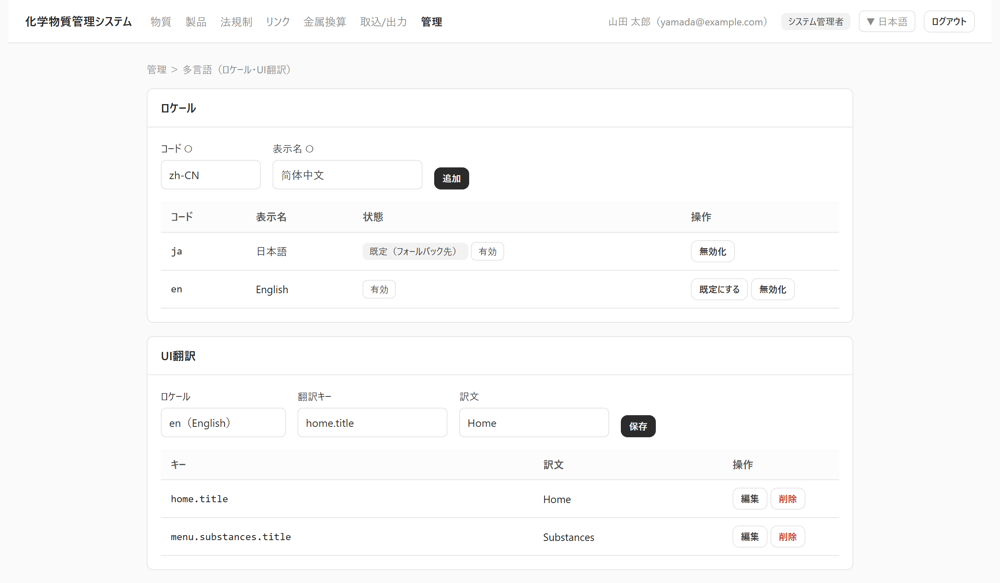

```
管理 ＞ 多言語（ロケール・UI翻訳）
┌ ロケール ─────────────────────────────────────┐
│ コード ○[__] 表示名 ○[______] [追加]           │
│《表》コード│表示名│状態《既定(フォールバック先)/有効/無効》│操作[既定にする][無効化/有効化]│
└───────────────────────────────────────────────┘
┌ UI翻訳 ───────────────────────────────────────┐
│ ロケール▼ 翻訳キー[example: home.title] 訳文[______] [保存]│
│《表》キー│訳文│操作[編集][削除]                 │
└───────────────────────────────────────────────┘
```
| No | 項目 | 必須 | 入力チェック |
|---|---|---|---|
| 1 | ロケールコード | ○ | `^[a-z]{2}(-[A-Za-z0-9]{2,8})?$` |
| 2 | 表示名 | ○ | ≤100 |
| 3 | 翻訳キー | ○ | ≤200 |
| 4 | 訳文 | − | ≤2000 |
- [既定にする]: 既定を付け替え（常に1件）。既定ロケールの無効化は不可。未翻訳キーは既定ロケールへフォールバック。

---

# 5. メッセージ一覧（画面横断）
| 種別 | 文言 | 契機 |
|---|---|---|
| 認証 | ログインが必要です | 未認証API(401) |
| 認証 | メールアドレスまたはパスワードが正しくありません | ログイン失敗 |
| 権限 | 編集権限がありません（参照・判定実行・ダウンロードのみ可能です） | 編集系API(403) |
| 権限 | システム管理者のみ実行できます | 管理API(403) |
| 権限 | 公開フラグの設定はシステム管理者・特権ユーザーのみ可能です | 製品フラグ変更(403) |
| 一意 | 〜コード「X」は既に使用されています | コード重複(409) |
| 参照 | 〜は N 件の…から参照されています。削除する場合は force=true を指定してください | 削除時(409) |
| 情報 | 保存しました。／取込完了: … | 保存・取込成功 |
| 警告 | ⚠️ 同一CAS番号（X）の物質が既に N 件… ／ 含有率合計が100%未満です… | 保存時警告 |

---

## 改訂履歴
| 版 | 日付 | 内容 |
|---|---|---|
| 1.0 | 2026-07-03 | 初版（全17画面のレイアウト・項目・アクション・メッセージ・権限制御） |
| 1.1 | 2026-07-03 | 全17画面にスクリーンショット（テストデータ表示）を追加 |
